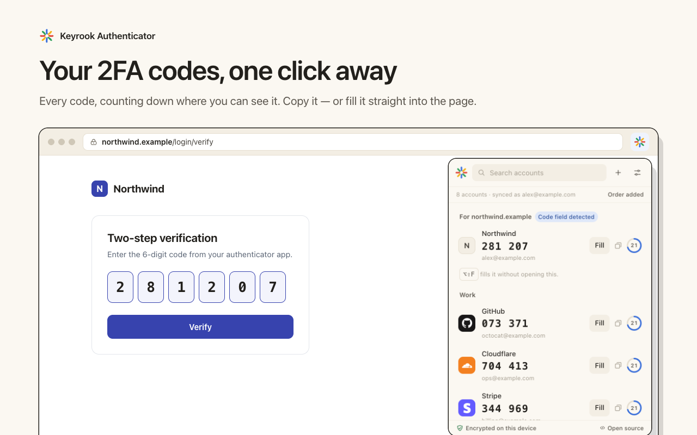
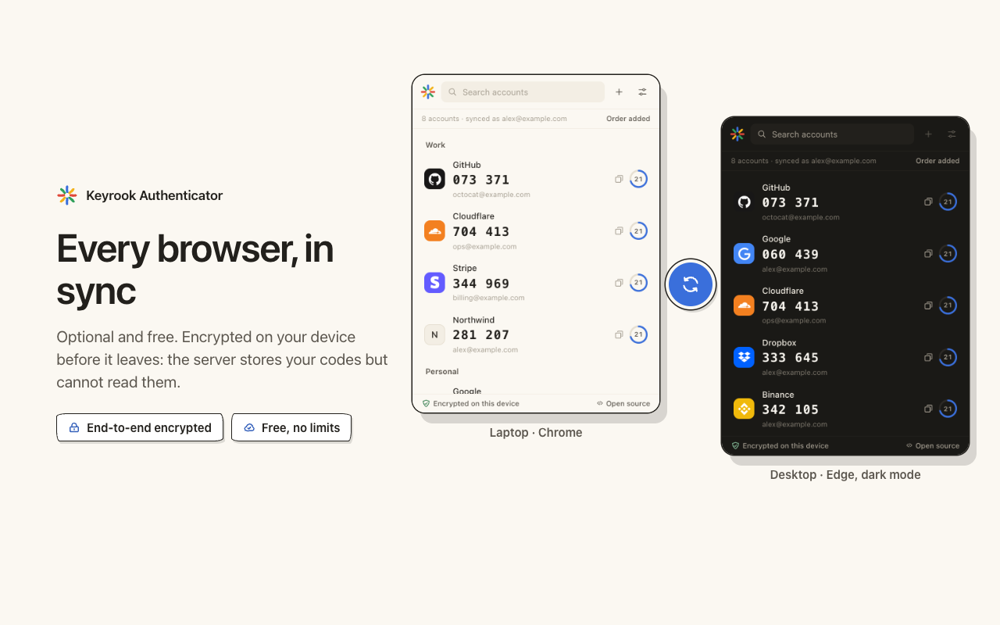

<p align="center">
  
</p>

<h1 align="center">Keyrook Authenticator</h1>

<p align="center">
  Two-factor codes (TOTP and HOTP) in your browser, encrypted on your own machine.<br>
  A Chrome and Edge extension, with optional end-to-end encrypted sync between your browsers.
</p>

<p align="center">
  <a href="https://chromewebstore.google.com/detail/occcfljfhlijenkofoceocnimkfpdndl">Chrome Web Store</a> ·
  <a href="https://microsoftedge.microsoft.com/addons/detail/lnbabkbknabedpnmdihllnbhdmolianm">Edge Add-ons</a> ·
  <a href="https://keyrook.com/authenticator/">Website</a> ·
  <a href="https://keyrook.com/authenticator/privacy/">Privacy policy</a> ·
  GPL-3.0-or-later
</p>

<p align="center">
  
</p>

## Why the source is open

A 2FA vault holds the keys to someone's whole online life. You should not have
to take anyone's word for how it is protected — so the code that runs on your
machine is here to read, build and check against what the stores ship.

## What is here, and what is not

```
packages/core/     @authx/core — OTP, vault encryption, the sync protocol and
                   client. No chrome.*, no DOM: it is written to be reused by
                   future desktop and mobile apps.
apps/extension/    The MV3 extension: service worker, popup, settings page and
                   the on-demand autofill script.
docs/              Architecture, the security model, the privacy policy.
scripts/           Icon generation and the release check.
```

**The sync server is not here.** That does not weaken what you can verify: the
client encrypts everything before it leaves the device and treats the server as
hostile, not merely unable to read. Records are bound to their id and revision
so the server cannot move or replay them, a record that will not open is skipped
rather than trusted, deletions are always surfaced, and a recovery-key state the
server hands back is refused unless it is authentic and newer than the last one
seen. [docs/security-model.md](docs/security-model.md) lists every guarantee the
client makes, and `packages/core/test/hostile-server.test.ts` plays that server.

This repository is a published copy of the development tree, updated at each
release. Each store release is tagged here (`vX.Y.Z`).

## What it does

- **Add accounts** by scanning the QR code on the page you are on, by pointing
  your camera at a code, by uploading a QR image, or by typing a setup key.
- **Import from Google Authenticator** — scan its "Export accounts" codes, several
  in one sitting and in any order, or pick screenshots of them.
- **Move in from other apps** — the exports of Aegis, 2FAS, andOTP, Bitwarden,
  FreeOTP+, Proton Authenticator, Ente Auth and the Authenticator extension,
  locked or not, and the two-factor column of a password manager's CSV. The
  passwords in such a file are never kept.
- **Codes** for TOTP (RFC 6238) and HOTP (RFC 4226), SHA-1/256/512, 6–10 digits,
  any period, verified against every published RFC test vector.
- **Autofill** into the one-time-code field of the page you opened the popup on,
  or with Alt+Shift+F where exactly one account belongs to the site.
- **A code without saving** — paste a key, see its code, keep nothing. The same
  is on [the website](https://keyrook.com/authenticator/code/), where the
  page's own security policy stops the key from leaving it.
- **Two ways to protect the vault** — a key the browser holds (nothing to type)
  or a master password — switchable without re-encrypting anything.
- **Encrypted backup** to a file, of every account or the ones you choose.
- **Never locked in** — pick the app you are moving to and it shows the quickest
  way there: Google Authenticator's own transfer codes (which Bitwarden, Proton,
  Ente, Aegis and 2FAS also read), an Aegis or Bitwarden file, or one setup code
  after another for apps that import nothing in bulk. Any single account's QR
  code from the popup, and a printable sheet. Readable exports ask for the master
  password first, when the vault has one.
- **A recovery key** on a printable sheet for when the password is forgotten.
- **Optional sync**, free and end-to-end encrypted, with no cap on how many
  accounts you keep. Sign in with an email address, Google or GitHub.
- **Fifty languages**, right to left where the language is.
- **Service logos** for over 500 services, compiled in and never fetched — a
  logo requested at display time would tell whoever serves it which services
  you have 2FA on.

<p align="center">
  
</p>

## Security in brief

Accounts are encrypted with AES-256-GCM under a data key. The data key is never
stored in the clear: it is wrapped by a non-extractable key the browser holds,
or by a key derived from your master password with PBKDF2-SHA256 at 600,000
rounds. Sync derives two unlinkable keys from the account password — one wraps
the data key and never leaves the device, the other proves the password to the
server. An account made with Google or GitHub has no password: a new browser
receives the data key only from one already signed in, after both show the
same code, or from the recovery key. The extension declares no host permissions; reading a QR from a page
and filling a code both run under `activeTab`, granted only for the tab you
invoked it on. Details: [docs/architecture.md](docs/architecture.md) and
[docs/security-model.md](docs/security-model.md).

## Building from source

You need Node 22 and npm.

```bash
npm ci
npm run typecheck
npx vitest run
npm run build -w @authx/extension
```

Load `apps/extension/dist` at **chrome://extensions → Developer mode → Load
unpacked**.

The end-to-end suite loads the built extension into a real Chromium:

```bash
npx playwright install chromium
npm run test:e2e -w @authx/extension
```

A build from this tree is the store's build: it talks to the official sync
server, `https://api.keyrook.com`, and nothing else. That server answers
only the store listings' extension ids, so a copy you load unpacked cannot sign
in; build with `VITE_SYNC_API_URL=` (empty) for one with the account features
switched off.

## Checking a store release against this source

Builds are deterministic: two builds of the same commit, from the same
lockfile, produce byte-identical files. To check what a store gave you:

1. Check out the tag for the version you have installed, then
   `npm ci && npm run build -w @authx/extension` with Node 22.
2. Find the installed copy: open `chrome://version`, take the **Profile Path**,
   and look in `Extensions/<extension id>/<version>/`.
3. Compare the two folders, for example with `diff -r`.

Expect differences only in the `_metadata/` folder and in `manifest.json` fields
the store adds itself, such as `update_url`.

## Reporting a vulnerability

Please do not open a public issue. See [SECURITY.md](SECURITY.md).

## Contributing

Issues and pull requests are welcome. Accepted changes are applied to the
development tree and appear here with the next release, credited to you. A few
rules the code already follows:

- Comments explain *why*, not what.
- Every security claim has a test that tries to break it, not one that restates it.
- No `host_permissions`, no declarative content scripts, nothing fetched at
  display time.
- User-facing copy is plain and honest about limits.

By contributing you agree that your contribution is licensed under
GPL-3.0-or-later.

## Licence

Copyright (C) 2026 BRICK IT ALL LLC.

This program is free software: you can redistribute it and/or modify it under
the terms of the GNU General Public License as published by the Free Software
Foundation, either version 3 of the License, or (at your option) any later
version. It is distributed in the hope that it will be useful, but WITHOUT ANY
WARRANTY; without even the implied warranty of MERCHANTABILITY or FITNESS FOR A
PARTICULAR PURPOSE. See [LICENSE](LICENSE) for the full text.

The brand artwork comes from third-party icon sets under their own licences,
listed in [NOTICE.md](NOTICE.md). Product names and logos belong to their owners
and are used only to identify the service an account belongs to.
